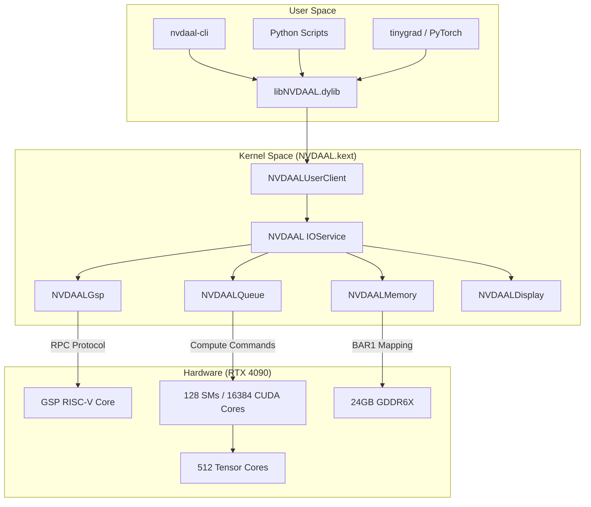
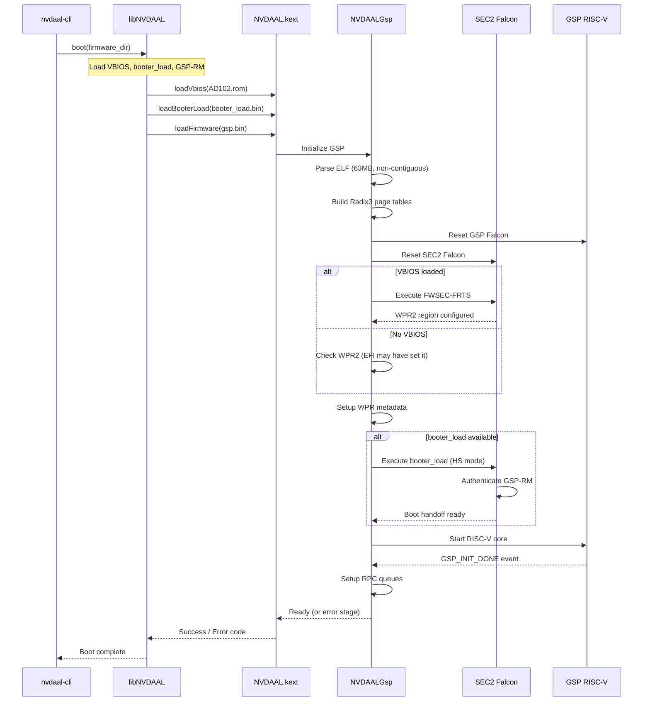
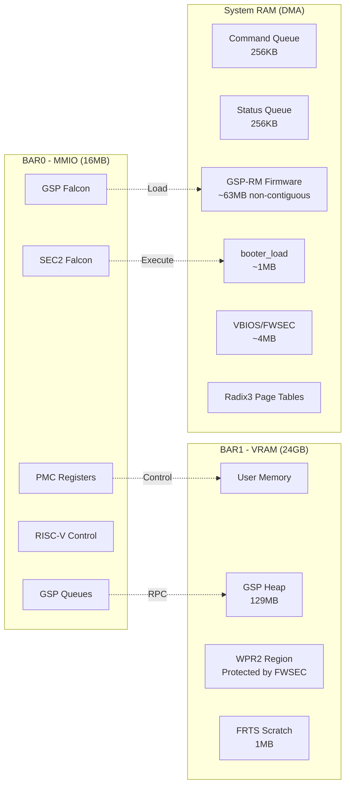
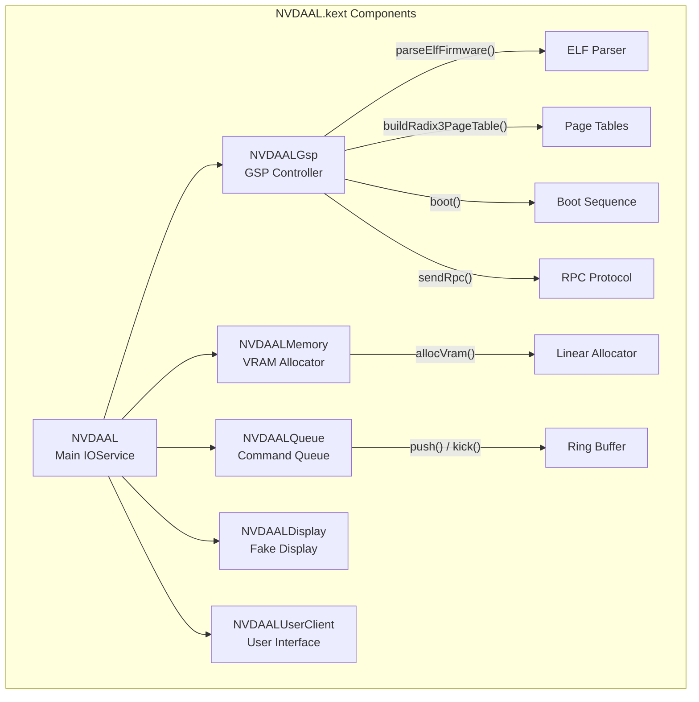

<h1 align="center">
  <br>
  
  <br>
  NVDAAL - NVIDIA Ada Lovelace Compute Driver
  <br>
</h1>

<p align="center">
  <strong>Open-source compute driver for RTX 40 series GPUs on macOS - Pure AI/ML power</strong>
</p>

<p align="center">
  
  
  
  
  
  <a href="https://github.com/gabrielmaialva33/NVDAAL-Driver/commits/master">
    
  </a>
  
</p>

<br>

<p align="center">
  <a href="#bookmark-about">About</a>&nbsp;&nbsp;&nbsp;|&nbsp;&nbsp;&nbsp;
  <a href="#rocket-quick-start">Quick Start</a>&nbsp;&nbsp;&nbsp;|&nbsp;&nbsp;&nbsp;
  <a href="#wrench-features">Features</a>&nbsp;&nbsp;&nbsp;|&nbsp;&nbsp;&nbsp;
  <a href="#gear-architecture">Architecture</a>&nbsp;&nbsp;&nbsp;|&nbsp;&nbsp;&nbsp;
  <a href="#memo-roadmap">Roadmap</a>&nbsp;&nbsp;&nbsp;|&nbsp;&nbsp;&nbsp;
  <a href="#handshake-contributing">Contributing</a>&nbsp;&nbsp;&nbsp;|&nbsp;&nbsp;&nbsp;
  <a href="#scroll-license">License</a>
</p>

<br>

## :bookmark: About

**NVDAAL** (NVIDIA Ada Lovelace) is an open-source **compute-only** driver for NVIDIA RTX 40 series GPUs on macOS Hackintosh. This driver focuses exclusively on **AI/ML workloads**, leveraging the full compute power of Ada Lovelace architecture without display overhead.

### :warning: Important Notice

This project is **experimental** and in early development. It requires:
- Deep understanding of GPU architecture
- Hackintosh environment with proper configuration
- GSP (GPU System Processor) firmware for full functionality

### :zap: Why Compute-Only?

| Aspect | Benefit |
|--------|---------|
| **Simplicity** | No framebuffer, display engine, or video output code |
| **Focus** | 100% of GPU power dedicated to compute workloads |
| **Viability** | Based on proven TinyGPU implementation |
| **Performance** | Direct access to CUDA cores and Tensor cores |

## :desktop_computer: Supported Hardware

| GPU | Device ID | CUDA Cores | Tensor Cores | Status |
|-----|-----------|------------|--------------|--------|
| RTX 4090 | `0x2684` | 16,384 | 512 | :construction: Development |
| RTX 4090 D | `0x2685` | 14,592 | 456 | :hourglass: Planned |
| RTX 4080 Super | `0x2702` | 10,240 | 320 | :hourglass: Planned |
| RTX 4080 | `0x2704` | 9,728 | 304 | :hourglass: Planned |
| RTX 4070 Ti Super | `0x2705` | 8,448 | 264 | :hourglass: Planned |
| RTX 4070 Ti | `0x2782` | 7,680 | 240 | :hourglass: Planned |
| RTX 4070 Super | `0x2860` | 7,168 | 224 | :hourglass: Planned |
| RTX 4070 | `0x2786` | 5,888 | 184 | :hourglass: Planned |

## :rocket: Quick Start

### :heavy_check_mark: Prerequisites

- macOS Tahoe 26+ (via OpenCore 1.0.7+)
- Xcode Command Line Tools
- NVIDIA RTX 40 series GPU
- Boot args: `kext-dev-mode=1` or `amfi_get_out_of_my_way=0x1`

### :arrow_down: Installation

```bash
# Clone the repository
git clone https://github.com/gabrielmaialva33/NVDAAL-Driver.git
cd NVDAAL-Driver

# Download GSP firmware
make download-firmware

# Build the kext + tools + library
make clean && make

# Validate structure
make test

# Load temporarily (for testing)
make load

# Check logs
make logs
```

### :zap: Boot Sequence

```bash
# Full boot with all firmwares (recommended)
nvdaal-cli boot Firmware/

# Legacy single-file load
nvdaal-cli load Firmware/gsp-570.144.bin
```

The `boot` command expects these files in the firmware directory:
| File | Required | Purpose |
|------|----------|---------|
| `gsp-570.144.bin` (or `gsp.bin`) | Yes | GSP-RM firmware |
| `booter_load-ad102-570.144.bin` | No | SEC2 booter (Heavy-Secure) |
| `AD102.rom` | No | VBIOS for FWSEC-FRTS |

### :package: Permanent Installation

```bash
# Install to /Library/Extensions
make install

# Reboot required
sudo reboot
```

## :wrench: Features

### Current (v0.6.0 - FWSEC Execution API & Ada Lovelace Parsing)
- :white_check_mark: PCI device detection and enumeration
- :white_check_mark: BAR0/BAR1 memory mapping (MMIO + VRAM)
- :white_check_mark: Chip identification (Ada Lovelace architecture)
- :white_check_mark: **GSP Controller Implementation**
  - ELF Firmware Parser (non-contiguous 63MB support)
  - Radix3 Page Table Builder (per-page physical addressing)
  - WPR2 Metadata Configuration
  - **Complete VBIOS Parsing**:
    - BAR0 VBIOS reading (direct from GPU at 0x300000)
    - ROM image scanning (0x55AA signatures)
    - PCIR header parsing & FWSEC image detection (type 0xE0)
    - BIT (BIOS Information Table) header scanning
    - Ada Lovelace Token 0x50 PMU table path (with Token 0x70 fallback)
    - PMU Lookup Table & Falcon Ucode Descriptor extraction
  - **Real FWSEC-FRTS Execution**:
    - Falcon IMEM/DMEM ucode loading
    - DMEMMAPPER interface patching (FRTS command 0x15)
    - GSP Falcon boot with timeout monitoring
  - **Enhanced Boot Sequence**:
    - SEC2 FALCON reset
    - FWSEC-FRTS execution (WPR2 setup)
    - booter_load on SEC2 (HS mode)
    - RISC-V core start (correct 0x118000 base for Ada)
  - Detailed error stages (`bootEx()`)
  - **Debug Mode**: Continues boot even on FWSEC/booter failures
  - **Register Scanning**: Auto-detect RISC-V base address
- :white_check_mark: **Full RPC Engine** (rmAlloc, rmControl)
- :white_check_mark: **Interrupt Driven Architecture**
  - MSI (Message Signaled Interrupts) support
  - Reactive status queue processing
- :white_check_mark: **Memory Management (MMU)**
  - Virtual Address Space (VASpace)
  - Page Directory/Table management
- :white_check_mark: **Compute Engine**
  - GPFIFO Channel creation
  - User Doorbell mapping
  - Command Submission
- :white_check_mark: **User-Space Interface**
  - IOUserClient for secure firmware upload
  - Zero-copy memory mapping
  - libNVDAAL shared library
  - Detailed error codes from kernel
- :white_check_mark: **CLI Tool** (nvdaal-cli)
  - `boot` command for full sequence
  - `fwsec` command for WPR2 configuration
  - `status` command for GPU register status
  - `load` command for legacy loading
- :white_check_mark: **Multi-Architecture Build**
  - arm64 (Apple Silicon)
  - x86_64 (Intel)

### In Development
- :construction: Compute Class (ADA_COMPUTE_A) Context
- :construction: Semaphore Synchronization

### Planned
- :hourglass: tinygrad/PyTorch integration

## :star: Pioneer Insights

As of v0.6.0, **NVDAAL** is one of the first open-source efforts to bring Ada Lovelace compute to macOS. Key architectural decisions made for excellence:

- **Lock-Free GSP RPC**: Using synchronous memory barriers and stack-allocated buffers to minimize kernel latency during GPU resource management.
- **Hardware-Native GPFIFO**: Fully compliant with the 128-bit entry format required by AD10x chips, enabling direct hardware work submission.
- **Dynamic MMU**: Implements a real-time Bump Allocator for GPU Virtual Address Space, ensuring memory isolation and proper page alignment for Tensor core workloads.
- **Complete Boot Pipeline**: Full SEC2 + FWSEC + GSP-RM boot sequence matching NVIDIA's reference implementation, with detailed error stage reporting for debugging.
- **Native VBIOS Parsing**: Complete VBIOS ROM parsing including PCIR headers, BIT tables, PMU lookup, and Falcon ucode extraction for real FWSEC-FRTS execution.
- **Non-Contiguous Memory**: Handles 63MB GSP-RM firmware without requiring physically contiguous allocation, using per-page Radix3 table entries.

### :chart_with_upwards_trend: Performance Status
| Component | Status | Optimization |
|-----------|--------|--------------|
| RPC Latency | :low_brightness: Low | Stack-based buffers |
| Memory Alloc | :high_brightness: High | Bump Allocator (Linear) |
| Submission | :high_brightness: High | Direct Doorbell (UserD) |
| Boot Diagnostics | :high_brightness: High | Error stage codes |

## :gear: Architecture

### System Overview



### GSP Boot Sequence (v0.4.0)



### Memory Layout



### Component Interaction



## :memo: Roadmap

| Phase | Description | Status |
|-------|-------------|--------|
| **1. Foundation** | PCI detection, BAR mapping, chip ID | :white_check_mark: Complete |
| **2. GSP Init** | Firmware loading, RPC setup, boot sequence | :white_check_mark: Complete |
| **3. User API** | libNVDAAL, IOUserClient, CLI tool | :white_check_mark: Complete |
| **4. Enhanced Boot** | SEC2/FWSEC/WPR2, booter_load, error diagnostics | :white_check_mark: Complete |
| **5. Memory** | VRAM allocation, DMA buffers, virtual memory | :construction: In Progress |
| **6. Compute** | Queue management, command submission, sync | :hourglass: Planned |
| **7. Integration** | tinygrad, PyTorch backends | :hourglass: Planned |

## :open_file_folder: Project Structure

```
NVDAAL-Driver/
├── Sources/                  # Kernel extension source
│   ├── NVDAAL.{h,cpp}       # Main IOService driver
│   ├── NVDAALGsp.{h,cpp}    # GSP controller & RPC
│   ├── NVDAALUserClient.{h,cpp}  # User-space interface
│   ├── NVDAALMemory.{h,cpp} # VRAM allocator
│   ├── NVDAALQueue.{h,cpp}  # Command queue
│   ├── NVDAALDisplay.{h,cpp}# Fake display engine
│   └── NVDAALRegs.h         # Register definitions
├── Library/                  # User-space SDK
│   ├── libNVDAAL.{h,cpp}    # C++ API wrapper
│   └── nvdaal_c_api.cpp     # C FFI bindings
├── Tools/
│   ├── nvdaal-cli/          # CLI firmware loader
│   ├── extract_vbios.py     # VBIOS extraction
│   └── test_driver.py       # Python test harness
├── Docs/                     # Technical documentation
│   ├── ARCHITECTURE.md      # Component details
│   ├── GSP_INIT.md          # GSP boot guide
│   └── TODO.md              # Development checklist
├── Firmware/                 # User-provided firmware
├── Info.plist               # Kext configuration
├── Makefile                 # Build system
└── README.md
```

## :handshake: Contributing

Contributions are welcome! Please read our [Contributing Guide](CONTRIBUTING.md) before submitting a PR.

### Development Commands

```bash
make clean           # Clean build artifacts
make                 # Build kext + tools + library
make rebuild         # Clean + build
make test            # Validate kext structure
make load            # Load kext temporarily
make unload          # Unload kext
make logs            # View driver logs (last 5 min)
make logs-live       # Stream logs in real-time
make status          # Check kext and PCI status
make download-firmware  # Download GSP firmware
```

## :books: Resources

- [TinyGPU/tinygrad](https://github.com/tinygrad/tinygrad) - Primary reference for GSP
- [NVIDIA open-gpu-kernel-modules](https://github.com/NVIDIA/open-gpu-kernel-modules) - Official open-source drivers
- [Nouveau Project](https://nouveau.freedesktop.org/) - Linux open-source NVIDIA driver
- [envytools](https://github.com/envytools/envytools) - NVIDIA GPU documentation

## :warning: Disclaimer

This project is for **educational and research purposes only**. There is no guarantee of functionality. Use of proprietary firmware may violate NVIDIA's license terms. Use at your own risk.

## :scroll: License

This project is licensed under the MIT License - see the [LICENSE](LICENSE) file for details.

---

<p align="center">
  Made with :purple_heart: by <a href="https://github.com/gabrielmaialva33">Gabriel Maia</a>
</p>
